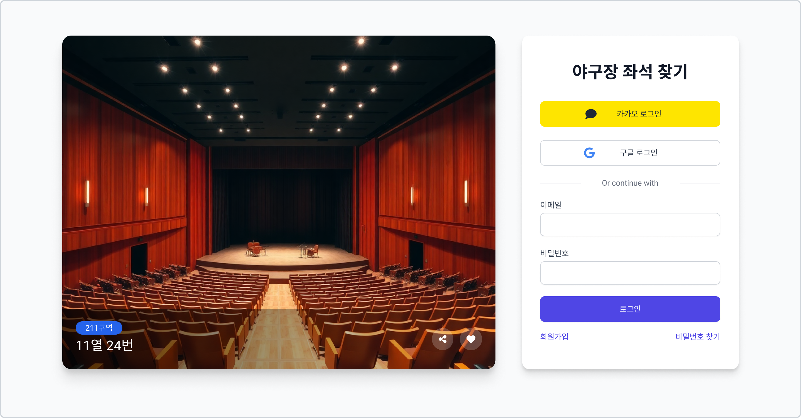
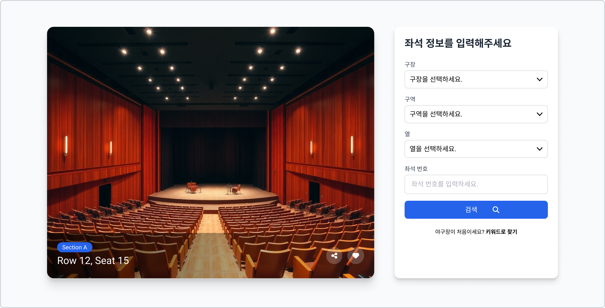
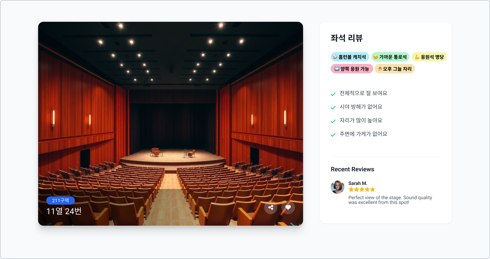

# 야구장 좌석뷰 찾기

| 기능    | 화면                      |
|-------|-------------------------|
| 로그인   |  |
| 좌석 찾기 |      |
| 좌석 상세 |  |

### 사용 대상

- 야구장을 가려는 사람들

### 문제 의식

- 처음 야구장을 가는 사람들은 좌석에 대한 정보가 부족하다.
- 야구장의 좌석 뷰가 어떤지 블로그를 검색하거나 유튜브를 검색해야 한다.
- 야구장에 가기 전 미리 좌석을 확인할 수 있는 방법이 없다.
- 좌석을 예매할 때 대부분 자동배정으로 돌리기 때문에 예매 완료 후 좌석을 확인해야 한다.

### 제공 서비스

- 좌석에 따라 장점과 단점을 확인할 수 있어야 한다.
- 좌석 번호를 입력하면 그 좌석의 뷰를 확인할 수 있어야 한다.
- 좌석 번호에 대한 뷰가 없으면 근처 좌석의 뷰를 확인할 수 있어야 한다.
- 원하는 뷰의 특징을 입력하면 그 뷰를 제공하는 좌석을 추천해 줄 수 있어야 한다.
- 좌석 근처에 있는 먹거리를 추천해 줄 수 있어야 한다.

### 사용 기술 및 라이브러리

- Next.js
- React
- TypeScript
- Tailwind CSS